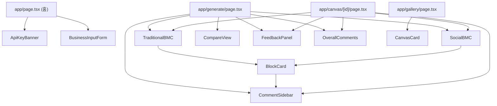

# BMC Generator — 구현 계획 (Implementation Plan)

## 개요

사용자가 사업 내용을 입력하면 **전통적 BMC(9블록)**와 **사회적 BMC(11블록, SPO용)**를 AI가 자동 생성하고,
객관적 피드백을 받고, 타인의 캔버스를 익명으로 열람·의견 작성할 수 있는 웹 시스템.

**참조 지침**: `instructions/base.md`

---

## 기술 스택 결정

| 영역 | 선택 | 이유 |
|---|---|---|
| 프레임워크 | **Next.js 14 (App Router)** | 서버 컴포넌트 + API Route로 AI 키 보안 처리 |
| 스타일링 | **Vanilla CSS (CSS Modules)** | 디자인 시스템 완전 제어, Tailwind 미사용 |
| AI 모델 | **Google Gemini 2.5 Flash-Lite** | 최신 경량 모델, 고속·저비용 (GA 출시 2025.07) |
| AI SDK | **`@google/genai`** | `@google/generative-ai`는 deprecated. 현재 공식 SDK |
| DB | **Supabase** (PostgreSQL + Realtime) | 익명 세션, 무료 티어, 실시간 댓글 가능 |
| 패키지 관리 | **uv** (가상환경) + **npm** (Next.js 의존성) | 현재 워크스페이스 환경 활용 |
| 배포 | **Vercel** | Next.js 최적화, 무료 티어 |
| 보안/관리 | **환경변수 관리** | 관리자 암호 (`ADMIN_PASSWORD`)를 통한 삭제 권한 제어 |

---

## 확정된 설계 결정 사항

> [!NOTE]
> 아래 항목들은 사용자 검토를 통해 확정되었습니다.

| 항목 | 결정 | 비고 |
|---|---|---|
| **API Key 관리** | 사용자가 직접 입력, 서버에 저장하지 않음 | 요청 시 헤더로 전달 → 서버에서 AI 호출 후 즉시 폐기 |
| **캔버스 공개 범위** | 전체 공개 (비공개 옵션 없음) | `is_public` 컬럼 제거, 모든 캔버스 조회 가능 |
| **의견 작성자** | 완전 익명 (session_id 기반) | 닉네임·로그인 없음 |
| **UI 언어** | 한국어 기본, 블록명 한국어+영문 병기 | 추후 다국어 확장 고려 없음 |
| **AI 모델** | `gemini-2.5-flash-lite` | `@google/genai` SDK 사용 |
| **DB** | **Supabase** (SQLite 불가) | 아래 이유 참조 |
| **Mock 모드** | 로컬 파일 기반 스토리지 지원 | `NEXT_PUBLIC_USE_MOCK=true` 시 사용 |

> [!WARNING]
> **SQLite on Vercel 불가** — Vercel 서버리스 함수는 **stateless + ephemeral 파일 시스템**이므로 SQLite `.db` 파일의 지속적 읽기·쓰기가 불가능합니다. 대안으로 SQLite 호환 클라우드 서비스인 **Turso**를 사용할 수 있으나, 설정 복잡도를 고려해 **Supabase**(PostgreSQL, 무료 티어)를 유지합니다.

---

## 주요 변경 사항 (사용자 피드백 반영)

> [!WARNING]
> `instructions/base.md`의 표에서 사회적 BMC를 "11블록"이라고 했으나 테이블에 12개 행이 있습니다(고객 세그먼트가 공동생산자/수혜자로 분리되어 2개 행을 차지). 실제 블록 수는 **11개** (Customer Segments를 하나의 블록으로 보되 내부를 2분류)입니다. 구현 시 이를 정확히 반영합니다.

### 변경 요약

| 항목 | 이전 계획 | 변경 후 |
|---|---|---|
| AI SDK | `@google/generative-ai` (deprecated) | **`@google/genai`** (현재 공식 SDK) |
| AI 모델 | `gemini-1.5-flash` | **`gemini-2.5-flash-lite`** |
| API Key 저장 | Next.js API Route 프록시 (메모리 유지) | **요청당 전달, 서버에 절대 저장 안 함** |
| 캔버스 공개 | 기본 공개 + 비공개 옵션 | **항상 전체 공개** (is_public 컬럼 제거) |
| DB | Supabase (기본 채택) | **Supabase 유지** (SQLite는 Vercel 서버리스 환경에서 지속 저장 불가) |

---

## 제안하는 변경 사항 (Proposed Changes)

---

### 1단계: 프로젝트 초기화 및 인프라 설정

#### [NEW] Next.js 프로젝트 (`./`) 초기화
- `npx create-next-app@latest` 로 현재 워크스페이스에 App Router 기반 Next.js 설치
- **`@google/genai`**, `@supabase/supabase-js` 패키지 설치 (`@google/generative-ai` 사용 안 함)
- 환경변수 파일 (`.env.local`) 구조 정의:
  - `SUPABASE_URL`, `SUPABASE_ANON_KEY`: Supabase 접속 정보
  - `ADMIN_PASSWORD`: 관리자 전용 삭제 암호
  - ⚠️ Gemini API Key는 환경변수에 저장하지 않음. 사용자가 매 요청마다 제공.

#### [NEW] Supabase 스키마 마이그레이션 파일
- `supabase/migrations/001_init.sql` — canvases, comments 테이블 생성
- `is_public` 컬럼 **제거** (모든 캔버스는 전체 공개)
- Row Level Security(RLS) 정책: 전체 읽기 허용, 본인 session_id로만 삭제 가능
- `supabase/seed.sql` — 예시 캔버스 데이터 (개발용)

---

### 2단계: 디자인 시스템 및 레이아웃

#### [NEW] `app/globals.css` — 전역 CSS 변수 및 디자인 토큰
- 색상 팔레트: 전통 BMC(블루 계열) / 사회적 BMC(그린 계열) / 공통(다크 배경)
- 타이포그래피: Google Fonts (Noto Sans KR + Inter) 정의
- CSS 커스텀 프로퍼티: `--color-primary`, `--color-social`, `--spacing-*`, `--radius-*` 등
- 애니메이션 키프레임: 페이드인, 슬라이드업, 펄스(로딩 중)

#### [NEW] `app/layout.tsx` — 루트 레이아웃
- 전역 헤더 (로고, 네비게이션: 생성하기 / 캔버스 둘러보기)
- 전역 푸터
- Toast 알림 컨텍스트 프로바이더
- Session ID 초기화 로직 (sessionStorage 기반 UUID 생성)

---

### 3단계: 핵심 컴포넌트

#### [NEW] `components/canvas/TraditionalBMC.tsx`
- 9블록 격자 레이아웃 구현 (Osterwalder 표준 배치)
  ```
  [KP] [KA] [VP] [CR] [CS]
       [KR]     [CH]
  [Cost Structure] [Revenue Streams]
  ```
- 각 블록: 블록명 헤더 + 내용 텍스트 + "의견 달기" 버튼

#### [NEW] `components/canvas/SocialBMC.tsx`
- 11블록 격자 레이아웃 (SPO용 배치)
  ```
  [Mission — 전체 너비]
  [KP] [KA] [VP] [CR/Co] [CS/Co]
       [KR]     [CH]    [CS/Ben]
  [Cost Structure] [Revenue Streams]
  [Impact & Measurement — 전체 너비]
  ```
- SPO 전용 블록(Mission, Impact) 시각적 강조 (다른 배경색, 아이콘)
- Co-creator / Beneficiary 구분 뱃지

#### [NEW] `components/canvas/BlockCard.tsx`
- 개별 블록 카드 UI (재사용 가능)
- Props: `blockKey`, `label`, `content`, `isHighlighted`, `onCommentClick`
- hover 시 "의견 달기" 버튼 표시
- 로딩 중 스켈레톤 애니메이션

#### [NEW] `components/canvas/CompareView.tsx`
- 전통 BMC / 사회적 BMC 나란히 비교 뷰
- 차이점 블록(Mission, 수혜자, Impact) 하이라이트 토글 기능
- 탭 전환: "비교 보기" ↔ "전체 보기"

#### [NEW] `components/feedback/FeedbackPanel.tsx`
- AI 피드백 5개 항목 카드 목록
- 각 항목: 카테고리명 + 점수(0~100) + 코멘트
- 점수 시각화: 원형 프로그레스 바 또는 색상 등급 뱃지
- 전체 종합 점수 표시

#### [NEW] `components/comments/CommentSidebar.tsx`
- 슬라이드인 사이드패널 (우측에서 등장)
- 선택된 블록의 기존 의견 목록
- 의견 작성 텍스트에어리어 + 제출 버튼
- 실시간 업데이트 (Supabase Realtime)

#### [NEW] `components/comments/OverallComments.tsx`
- 캔버스 하단 종합 의견 섹션
- 의견 목록 + 작성 폼

#### [NEW] `components/ui/` — 공통 UI 컴포넌트
- `Button.tsx`: 기본·아웃라인·고스트 변형
- `Input.tsx`, `Textarea.tsx`: 폼 인풋
- `Modal.tsx`: 범용 모달
- `Toast.tsx`: 성공/에러/정보 알림
- `Spinner.tsx`: 로딩 인디케이터
- `Badge.tsx`: 블록 타입 구분 뱃지

#### [NEW] `components/layout/ApiKeyBanner.tsx`
- 상단 고정 배너: API Key 미입력 시 표시
- Google AI Studio 키 발급 링크 포함
- 키 입력 인라인 폼 (입력 후 세션 상태에 저장)

#### [NEW] `components/admin/AdminAction.tsx`
- 관리자 인증을 위한 입력창 또는 모달
- 관리자 암호 입력 시 `localStorage` 또는 `sessionStorage`에 임시 저장 (삭제 요청 시 헤더로 전송)
- 관리자 인증 상태에 따라 삭제 버튼 노출 여부 결정

---

### 4단계: 페이지 구성

#### [NEW] `app/page.tsx` — 랜딩 + 사업 입력 페이지 (홈)
- 서비스 소개 히어로 섹션 (BMC 개념 간단 설명, SPO BMC 차별점 강조)
- 사업 정보 입력 폼:
  - 사업 주제/제목 (필수)
  - 사업 목적 및 비전 (필수, 텍스트에어리어)
  - 주요 고객군 (선택)
  - 핵심 가치 (선택)
  - 조직 유형 선택: "일반 기업" / "사회적 기업·비영리" (→ 사회적 BMC 기본 선택)
- "캔버스 생성하기" CTA 버튼

#### [NEW] `app/generate/page.tsx` — 캔버스 생성 + 결과 페이지
- 생성 중: 로딩 애니메이션 + 단계 표시 ("AI가 분석 중입니다...")
- 생성 완료: 전통 BMC + 사회적 BMC 나란히 표시
- 상단 툴바: "AI 피드백 받기" / "저장 및 공유" / "비교 하이라이트 토글"
- AI 피드백 패널 (접고 펼치기)
- 블록 클릭 → Comment Sidebar 오픈
- 전체 의견 섹션 (페이지 하단)

#### [NEW] `app/gallery/page.tsx` — 공개 캔버스 갤러리
- 공개 캔버스 카드 목록 (그리드, 무한 스크롤)
- 카드 정보: 사업 주제, 생성일, 블록 요약, 의견 수
- 필터: 전체 / 일반 BMC / SPO BMC
- 정렬: 최신순 / 의견 많은 순

#### [NEW] `app/canvas/[id]/page.tsx` — 캔버스 상세 열람 페이지
- 타인의 캔버스 전체 보기 (읽기 모드)
- 블록 클릭 → 해당 블록 의견 열람 + 의견 작성
- AI 피드백 결과 표시 (있는 경우)
- 전체 의견 섹션

---

### 5단계: 서버 사이드 (API Routes)

#### [NEW] `app/api/generate/route.ts` — 캔버스 생성 API
- 입력: 사업 정보 JSON + Google API Key (요청 **바디**에 포함, 헤더 미사용)
- API Key는 이 함수 스코프 안에서만 사용 후 즉시 소멸 — **서버 어디에도 저장·로그 안 함**
- SDK: `@google/genai`, 모델: `gemini-2.5-flash-lite`
- 처리: Gemini API 호출 → JSON 파싱 및 유효성 검증
- 출력: 전통 BMC + 사회적 BMC JSON
- 오류 처리: JSON 파싱 실패 시 재시도(최대 2회) 또는 에러 응답

#### [NEW] `app/api/feedback/route.ts` — AI 피드백 생성 API
- 입력: 생성된 캔버스 JSON + Google API Key (요청 바디)
- API Key는 함수 스코프 내에서만 사용, 저장 안 함
- SDK: `@google/genai`, 모델: `gemini-2.5-flash-lite`
- 처리: Logic Validator 프롬프트 실행
- 출력: 피드백 JSON (5개 항목 + 점수)

#### [NEW] `app/api/canvases/route.ts` — 캔버스 저장/목록 조회 API
- `POST`: 캔버스 저장 (Supabase insert, session_id 자동 부여, is_public 컬럼 없음 — 항상 공개)
- `GET`: 전체 캔버스 목록 조회 (페이지네이션, 별도 필터 없음)

#### [NEW] `app/api/canvases/[id]/route.ts` — 캔버스 단건 조회/삭제 API
- `GET`: 특정 캔버스 상세 데이터
- `DELETE`: 특정 캔버스 삭제
  - **관리자 권한 확인**: 요청 헤더의 `x-admin-password`가 서버의 `ADMIN_PASSWORD`와 일치하는지 확인.
  - 일치하는 경우 작성자 session_id와 관계없이 삭제 허용.

#### [NEW] `app/api/comments/route.ts` — 의견 저장/조회/삭제 API
- `POST`: 의견 저장 (canvas_id, block_key, content, session_id)
- `GET`: 특정 캔버스의 의견 목록 (`?canvas_id=&block_key=`)
- `DELETE`: 특정 의견 삭제
  - **관리자 권한 확인**: 요청 헤더의 `x-admin-password`가 서버의 `ADMIN_PASSWORD`와 일치하는지 확인.

---

### 6단계: 유틸리티 및 상태 관리

#### [NEW] `lib/gemini.ts` — Gemini API 클라이언트 유틸
- **`@google/genai`** SDK 사용 (deprecated `@google/generative-ai` 미사용)
- 모델명 상수: `gemini-2.5-flash-lite`
- Canvas Generator 시스템 프롬프트 상수 (base.md §1 기반)
- Logic Validator 시스템 프롬프트 상수 (base.md §3 기반)
- JSON 파싱 + 유효성 검증 함수
- 블록 키 목록 상수 (전통 9개 / 사회적 11개)
- ⚠️ API Key를 모듈 레벨에서 초기화하지 않음 — 매 호출마다 인자로 받아 사용

#### [NEW] `lib/supabase.ts` — Supabase 클라이언트 초기화
- 서버 사이드용 클라이언트 (API Routes에서 사용)
- 클라이언트 사이드용 클라이언트 (Realtime 댓글용)

#### [NEW] `lib/db.ts` — DB 서비스 추상화 레이어
- `NEXT_PUBLIC_USE_MOCK` 환경변수에 따라 Supabase 또는 Mock 스토리지(로컬 JSON) 선택
- `canvases`, `comments` 테이블에 대한 CRUD 메서드 제공
- 로컬 테스트 시 Supabase 연결 없이도 데이터 생성 및 조회 가능하도록 지원

#### [NEW] `lib/session.ts` — 익명 세션 관리
- `sessionStorage` 기반 UUID 생성 및 유지
- 세션 ID를 통한 "내 캔버스" 식별

#### [NEW] `lib/bmc-schema.ts` — BMC 블록 스키마 정의
- 전통 BMC 9블록 메타데이터 (key, label, description, gridArea)
- 사회적 BMC 11블록 메타데이터 (key, label, description, gridArea, isSpoBmc)
- 블록 배치 레이아웃 맵

#### [NEW] `context/ApiKeyContext.tsx` — API Key 전역 상태
- React Context로 Google API Key 세션 관리
- 키 유효성 검증 (간단한 형식 체크)

---

### 7단계: SEO 및 접근성

#### [MODIFY] 각 페이지별 메타데이터 설정
- `app/page.tsx`: 서비스 소개 title/description
- `app/gallery/page.tsx`: 캔버스 갤러리 title
- `app/canvas/[id]/page.tsx`: 동적 캔버스 제목 기반 메타데이터

#### [NEW] `public/` — 정적 자산
- `og-image.png`: OG 이미지 (소셜 공유용)
- `favicon.ico`, `apple-touch-icon.png`

---

## 페이지 라우팅 구조

```
/                         → 랜딩 + 사업 입력 (홈)
/generate                 → 캔버스 생성 + 결과
/gallery                  → 공개 캔버스 갤러리
/canvas/[id]              → 캔버스 상세 열람

/api/generate             → POST: AI 캔버스 생성
/api/feedback             → POST: AI 피드백 생성
/api/canvases             → GET(목록) / POST(저장)
/api/canvases/[id]        → GET(단건)
/api/comments             → GET(조회) / POST(저장)
```

---

## 컴포넌트 의존성 다이어그램



---

## Supabase 스키마 상세

### `canvases` 테이블

| 컬럼 | 타입 | 설명 |
|---|---|---|
| `id` | UUID PK | 캔버스 고유 ID |
| `session_id` | TEXT | 익명 작성자 세션 |
| `subject` | TEXT | 사업 주제 |
| `org_type` | TEXT | `general` / `spo` |
| `input_data` | JSONB | 사용자 입력 원본 |
| `traditional_data` | JSONB | 전통 BMC 9블록 |
| `social_data` | JSONB | 사회적 BMC 11블록 |
| `ai_feedback` | JSONB | AI 피드백 구조화 JSON |
| ~~`is_public`~~ | ~~BOOLEAN~~ | **제거됨** — 모든 캔버스는 전체 공개 |
| `created_at` | TIMESTAMPTZ | 생성 시각 |

### `comments` 테이블

| 컬럼 | 타입 | 설명 |
|---|---|---|
| `id` | UUID PK | 의견 고유 ID |
| `canvas_id` | UUID FK | 대상 캔버스 |
| `session_id` | TEXT | 익명 작성자 세션 |
| `canvas_type` | TEXT | `traditional` / `social` |
| `block_key` | TEXT | 블록 키 (null이면 전체 의견) |
| `content` | TEXT | 의견 내용 |
| `created_at` | TIMESTAMPTZ | 생성 시각 |

---

## 검증 계획 (Verification Plan)

### 자동 검증
- `npm run build`: 빌드 오류 없음 확인
- `npm run lint`: ESLint 통과

### 기능 검증 (브라우저 테스트)
1. 홈 → 사업 정보 입력 → "캔버스 생성하기" 클릭
2. 생성 결과 페이지에서 전통/사회적 BMC 양쪽 모든 블록 내용 표시 확인
3. "AI 피드백 받기" → 5개 항목 점수 + 코멘트 표시 확인
4. "저장 및 공유" → Supabase에 저장 확인 (개발자 도구 네트워크 탭)
5. 갤러리 페이지 → 저장된 캔버스 카드 표시 확인
6. 캔버스 상세 → 블록 클릭 → 사이드 패널 열림 + 의견 작성 확인
7. 비교 하이라이트 토글 동작 확인

### 수동 검증
- API Key 미입력 시 배너 표시 및 생성 차단 확인
- 잘못된 API Key 입력 시 에러 메시지 확인
- **관리자 삭제 기능 테스트**: 
  - 관리자 암호 입력 후 캔버스 및 의견 삭제 버튼 동작 확인.
  - 잘못된 암호 입력 시 삭제 요청 거부 확인.
- 모바일 반응형 레이아웃 확인 (캔버스 세로 스택 전환)
